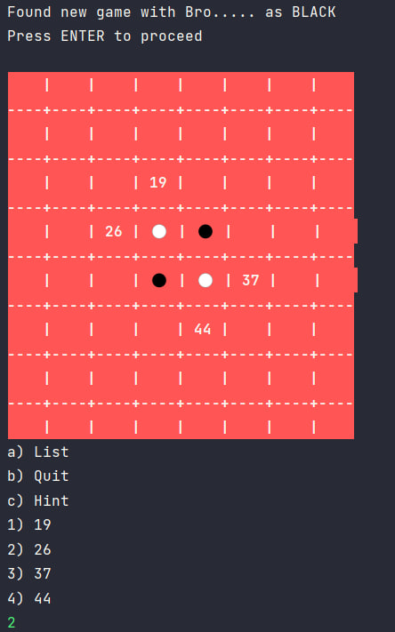
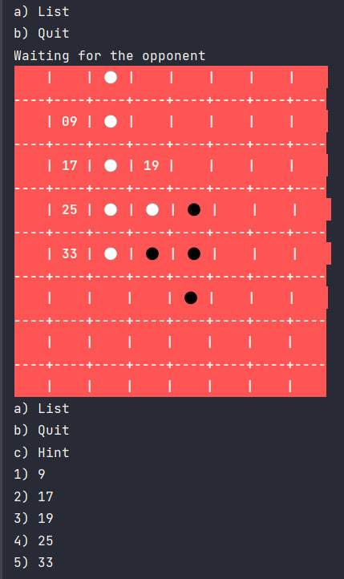

## Name

Multiplayer Othello Game

## Description

A multiplayer game of Othello where you can either play as yourself and get hints from the AIs or let the AI play for
you entirely. It's through a client-server connection which will then handle your request and send it to other players.
The client is a textual user interface, which means you interact with it through a console and by typing your inputs to
the program.

## Installation

SDK: Oracle OpenJDK 17.0.1

Language level: 17

Need to have Java on your machine to run the jar files for the server and client. Or additionally run and compile the
Java classes of client.OthelloApp and server.OthelloServerApp yourself.

## Usage

Create a server with a specific port. by running the jar file for server or server.OthelloServerApp
Then run at least two instances of the client jar file or client.OthelloApp.
Give the clients the address and port of the server and follow the menus given to you by the clients.
Client only sends the queue request to the server **after** the player who will be playing the game has been chosen.

## Support

Email us at:

- h.zakeri@student.utwente.nl
- n.j.vanmaare@student.utwente.nl

## Roadmap

The server could be fixed to be faster. and client's UI can become more friendly
by giving users more clear instructions and bette menus.

## Visuals

